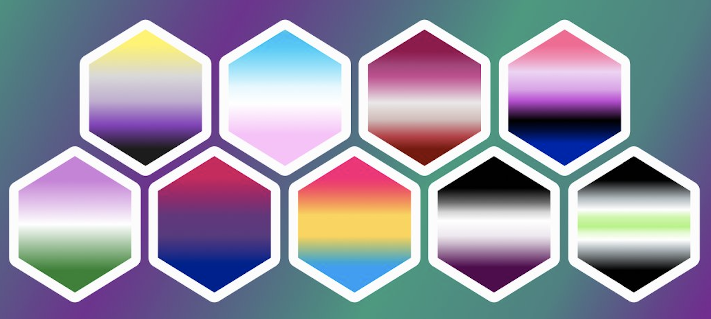
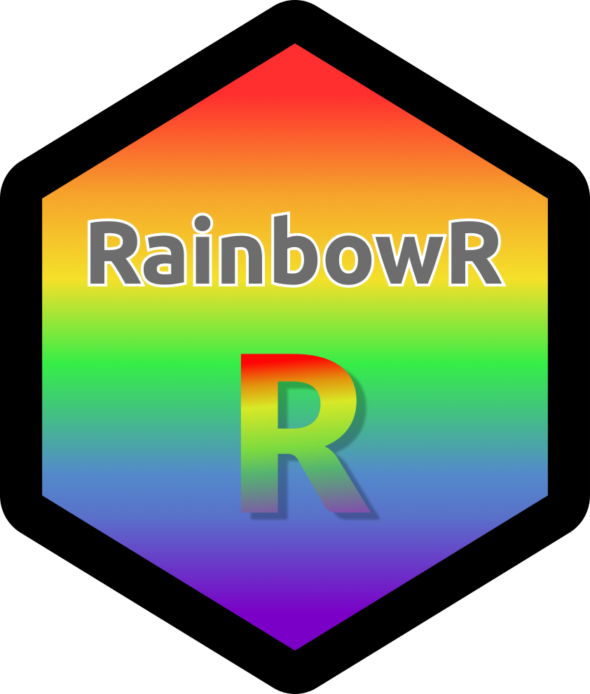

```{r setup, include=FALSE}
options(htmltools.dir.version = FALSE)
knitr::opts_chunk$set(collapse = TRUE, fig.retina = 3)
```

```{r xaringan-themer, include=FALSE, warning=FALSE}
library(xaringanthemer)
style_mono_dark(
    #base_color = "#D4006A",
    base_color = "#32fbe2",
    text_font_google = google_font("Montserrat"),
)
```

class: center, middle

# Reviving RainbowR

### Ella Kaye (She/Her) and Zane Dax (She/They)

### May 18th, 2022



---

## Overview
.pull-left[
-   Notes about this session

-   What is RainbowR?

-   Who is it for?

-   Past, present and future

-   Connecting and brainstorming breakout

-   Back together

-   Next steps
]

.pull-right[
```{r, echo=FALSE, out.width="75%"}

```
]
---

## Session Notes

-   This session is confidential
    -   not recorded
    -   notes won't be publicly shared
    
-   etherpad document (link in chat)

-   operating under [RLadies Code of Conduct](https://rladies.org/code-of-conduct/) (until the RainbowR one is finalised)
    -   any unresolved issues to rlgbtq@gmail.com

---

class: center, middle

# Our mission is to *support*, *promote* and *connect* LGBTQ+ people in the R community and to *spread awareness* of LGBTQ+ issues through data-driven activism.

---

## LGBTQ+ people

--

-   those who identify as being a minority sexual orientation, i.e. those who are not straight/heterosexual

-   those who are not cisgender, i.e. those whose sense of personal identity and gender does not correspond with their birth sex

--

## These are RainbowRs!

--

To our straight, cis friends: we very much appreciate your allyship and your support of RainbowR, e.g. by sharing our information and posts on social media and by telling your friends and colleagues about us.

---

class: center, middle

# Past, present, future

---

## Past

-   Founded at useR!2017

-   Infrastructure set up

-   Attempt to revive in 2019


---
## Present

- New-found time and enthusiasm (Ella)! 

- New-found interest and driving-force in the group (Zane)!

- This is an announcement of intent to *really* get RainbowR going this time!

--

### Existing infrastructure

-   Slack: [https://rainbowr.slack.com](https://rainbowr.slack.com) (60 members, currently dormant)

-   GitHub: [rlgbtq](https://github.com/rlgbtq) (currently dormant)

-   Twitter: [@R_LGBTQ](https://twitter.com/R_LGBTQ) (recently revived)

---

## Future/Works in Progress

-   Revive the Slack group 
    -   Needs sign-up page
    -   New Code of Conduct and review process
    -   Ownership
    
-   New website
    - Introductory blog-post
    
---

## Over to you...

- Breakout rooms to connect with others

- Some topics to discuss:

  - what would *you* like RainbowR to be, in order to best serve its community?
  
  - what kind of activities would you like RainbowR to run?
  
  - ideas for blog-posts
  
  - ideas for data sets for data-driven activism
  
  - would you like to contribute and, if so, how?
  
  - Anything else you'd like to add
  
- Notes on the etherpad (put link in chat again!)

---

## Back together

- Share ideas from the breakout room

- Any questions?

---

## Next steps

- Review and incorporate ideas from this session

- Complete work in progress

- Relaunch!

  - Announcements on Twitter
  
  - Announcements through other groups promoting diversity and community in R
  
  - Another community call, perhaps as part of next Forwards Slackathon

---

class: center, middle

# Thank you!

```{r, echo=FALSE, out.width="50%"}

```